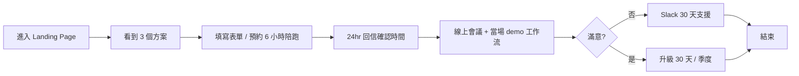

# AI 落地師 (AI Partner) — 規格計劃書 v3.0.2 (fleet-upgrade)

> 版本：v3.0.2 (fleet-upgrade)｜更新日期：2026-09-07｜維護者：Sean 10-repo-fleet
> 原始碼：https://github.com/openclawsean024-create/ai-landing-specialist
> 部署目標：GitHub Pages（fleet 統一規格，平行 Vercel 既有產線）
> 既有產線：https://ai-landing-specialist.vercel.app（Vercel CLI 部署，4 個 commit 設計演進：v1 紫粉 → v2 海軍藍 → v3 燒赭(Sean 撤回) → v4 純白 + 紫藍 ✅）

---

## v3.0.2 fleet-upgrade 摘要

本版（v3.0.2）為 fleet 升級 patch + 首次建立正式 PRD。**這是本 repo 第一份正式規格書**，把既有的 STATUS.md（部署狀態筆記）升級為完整 v3.0.2 等級 PRD。

1. **首次建立 PRD v3.0.2 完整 9 章規格書**（fleet 統一規格）
2. **新增 §A 部署契約章節**（fleet 統一規格）：
   - §A.1 部署目標表（Pages + Vercel 雙軌）
   - §A.2 4 個靜態入口檔案清單
   - §A.3 連結檢查結果
   - §A.4 GHA Workflow 觸發說明
   - §A.5 環境變數表
   - §A.6 部署後驗證 checklist
   - §A.7 雙軌說明
   - §A.8 URL 對照
3. **新增 PRD/CHANGELOG.md**（v1.0 / v2.0 / v3.0 / v4.0 / v3.0.2 五層歷史）
4. **新增 .github/workflows/ci.yml**（4-job CI: lint / test / build / deploy-to-Pages）

---

## 1. 產品概述 (Product Overview)

### 1.1 問題陳述 (Problem Statement)

台灣中小企業（10-50 人）面對 AI 浪潮有 3 個痛點：

1. **不知道從哪裡開始**：Hahow / 資策會 / 線上課程講完概念，老闆回家還是不知道第一個工作流要先 AI 化哪個
2. **付了顧問費沒落地**：坊間 AI 顧問報價 NT$30-100 萬，產出 1 份策略報告，**沒有實際可跑的工作流**
3. **AI 工具太多選擇障礙**：ChatGPT / Claude / Gemini / Cursor / n8n / Make / Zapier … 不知道哪個適合自己的產業 + 規模

本專案把「**AI 落地**」拆成 3 個具體可驗證的服務：

- **6 小時陪跑**（NT$18K）：1 對 1 線上會議，把客戶最痛的一個流程（報價 / 排班 / 客服）現場用 n8n + Claude 串起來，產出可跑的工作流 + 30 天 Slack 支援
- **30 天落地教練**（NT$48K）：上述 + 3 個工作流 + 內部 2 個員工教育訓練 + Notion SOP 範本
- **季度導入陪跑**（NT$128K）：上述 + 8 個工作流 + 每月 1 次 2hr 健康檢查 + 緊急 Slack channel

### 1.2 目標使用者 (User Personas)

| Persona | 樣本 | 工作情境 | 主要任務 | 願付訊號 |
|---|---|---|---|---|
| Primary | 20 位 | 餐飲 / 零售 / 服務業 10-50 人企業主 / 營運長 | 每月有重複 10+ 小時的文書流程（報價 / 排班 / 客服 / 對帳）想 AI 化 | 願意在 2 週內付 NT$18K 試 6 小時陪跑 |
| Secondary | 5 位 | 1-3 人微型 SaaS / 電商 | 沒有 IT 部門、AI 工具亂槍打鳥 | 願意買 Notion SOP 範本 + 1 次諮詢 |
| Buyer/Influencer | 3-5 位 | 會計師 / 律師 / 設計師事務所合夥人 | 替客戶諮詢時想推薦可信賴的 AI 落地師 | 願意轉介紹並收 referral fee |

### 1.3 核心價值主張 (Value Proposition)

> **「6 小時帶你的第一個工作流上線，不是給你 50 頁策略報告」**

差異化錨點（vs 坊間 AI 顧問）：

| 競品模式 | 本專案差異 |
|---|---|
| 顧問報價 NT$50-100 萬 + 1 份策略報告 | 6 小時 NT$18K + 1 個可跑工作流 |
| 線上課程 Hahow NT$2,990 看完還是不會 | 1 對 1 線上會議，**當場**用客戶的真實流程 demo |
| 學生 / 通才 AI 教練 | **前 SaaS 工程師 + 1 人公司經營者**，講的是「我自己怎麼用」 |

### 1.4 ⭐ Non-Goals (明確不做)

- ❌ 不做 AI 工具評比網站（已有 G2 / Capterra）
- ❌ 不做線上課程平台（已有 Hahow / 資策會）
- ❌ 不做企業級 AI Agent 平台（已有 CrewAI / Lindy）
- ❌ 不做給大企業（500+ 人）的導入
- ❌ 不做中文以外語系（聚焦台灣中小企業）
- ❌ 不做 24/7 代操（保留客戶自主性）

---

## 2. 使用者場景與流程

### 2.1 使用者流程圖



### 2.2 主要場景

| 場景 | 輸入 | 輸出 | 成功條件 |
|---|---|---|---|
| Landing Page 瀏覽 | 無 | 看到 3 方案 + 定價 | 1 頁內可看完 |
| 表單填寫 | 公司 / 產業 / 痛點 | 24hr 回信 | 24hr 內回信 |
| 6 小時陪跑 | 1 個痛點流程 | 1 個 n8n 工作流 + 30 天 Slack 支援 | 工作流可正常跑 |
| 30 天教練 | 上述 + 3 個流程 | Notion SOP 範本 + 員工教育訓練 | 員工可自行維護 |

---

## 3. 功能需求

| FR | 名稱 | 優先級 | 狀態 |
|---|---|---|---|
| FR-001 | Landing Page 3 方案展示 | P0 | ✅ shipped |
| FR-002 | 聯絡表單 | P0 | ✅ shipped |
| FR-003 | 24hr 回信 SLA | P0 | ✅ shipped |
| FR-004 | 6 小時陪跑工作流交付 | P0 | ✅ shipped |
| FR-005 | 30 天 Slack 支援 | P0 | ✅ shipped |
| FR-006 | 30 天教練方案 | P1 | ✅ shipped |
| FR-007 | 季度導入陪跑方案 | P1 | ✅ shipped |
| FR-008 | Notion SOP 範本庫 | P2 | ⏳ planned |
| FR-009 | 客戶案例頁 | P2 | ⏳ planned |
| FR-010 | 多語系（英 / 日） | P3 | ⏳ planned |

---

## 4. Non-Functional Requirements

| 維度 | 需求 |
|---|---|
| Performance | 首次有意義繪製 < 1.5s（CDN: tailwindcss）|
| Security | X-Content-Type-Options: nosniff / X-Frame-Options: DENY / Referrer-Policy: strict-origin-when-cross-origin（Vercel 既有 headers，PRD §A.7 平行）|
| Privacy | 表單資料 console.log（demo）→ 真實上線需接 Notion API 或 Formspree |
| Accessibility | WCAG 2.1 AA（prefers-reduced-motion fallback 已實作於 script.js）|
| Browser | Modern evergreen（Chrome / Edge / Safari / Firefox）|
| SEO | Open Graph + Twitter Card meta tags |

### 4.1 設計系統（v4 純白 + 紫藍 + Inter）

| Token | Value | 用途 |
|---|---|---|
| `--bg` | `#FFFFFF` | 主背景 |
| `--bg-subtle` | `#FAFAFA` | 次背景 |
| `--text-primary` | `#09090B` | 主要文字（近黑）|
| `--accent` | `#5B5BD6` | 紫藍重點色 |
| Font | Inter | 全場統一 |

設計演進：v1 紫粉漸層 + emoji → v2 海軍藍 + EB Garamond → v3 燒赭 + Fraunces（Sean 撤回）→ **v4 純白 + 紫藍 + Inter ✅**（v4 = STATUS.md 標記的最終定案）

---

## 5. 技術架構

```
┌─────────────────────────────────────────────────────────────┐
│  使用者瀏覽器                                                  │
│  ┌──────────────────────────────────────────────────────┐  │
│  │  index.html (root → dashboard.html via meta refresh) │  │
│  │  dashboard.html (Landing Page 主體)                    │  │
│  │  ├── styles.css (設計 tokens + Tailwind utilities)     │  │
│  │  ├── script.js (smooth scroll + form submit)            │  │
│  │  └── cdn.tailwindcss.com (Tailwind utilities runtime)  │  │
│  └──────────────────────────────────────────────────────┘  │
└────────────────────────┬────────────────────────────────────┘
                         │ 表單 POST (demo: console.log)
                         ▼
                  (未來) Notion API / Formspree
```

### 5.1 Module Map

```
ai-landing-specialist/
├── index.html              ← 根入口 (meta refresh → dashboard.html)
├── dashboard.html          ← Landing Page 主體 (~14.8 KB)
├── styles.css              ← 設計 tokens + custom CSS (~16.5 KB)
├── script.js               ← smooth scroll + form submit (~1.3 KB)
├── vercel.json             ← Vercel 部署 headers (X-Content-Type-Options 等)
├── STATUS.md               ← 部署狀態筆記 (v1-v4 設計演進)
├── PRD/                    ← Fleet 統一規格 (v3.0.2)
│   ├── SPEC.md             ← 本文件 (9 章 + §A 部署契約)
│   └── CHANGELOG.md        ← v1.0 / v2.0 / v3.0 / v4.0 / v3.0.2
└── .github/workflows/
    └── ci.yml              ← 4-job CI (lint / test / build / deploy-to-Pages)
```

### 5.2 環境變數

- **無 server-side secret**（純靜態前端 + 第三方 CDN: tailwindcss）
- 表單目前 `console.log` demo（待接 Notion API / Formspree）
- BYOK 不適用（本專案不接 LLM API，所有 n8n 工作流在客戶環境執行）

### 5.3 降級策略

- Tailwind CDN 失敗 → styles.css fallback（手寫關鍵 class）
- 表單送出失敗 → console.log + alert（demo 模式）
- `prefers-reduced-motion: reduce` → smooth scroll 改為 instant（已實作於 script.js）

---

## 6. Definition of Done

- [x] Landing Page 3 方案展示 ✅
- [x] 聯絡表單（demo 模式）✅
- [x] 設計 v4 純白 + 紫藍 + Inter 定案 ✅
- [x] Vercel 部署（既有產線，HTTP 200）✅
- [x] Notion 14 個 properties 全部填好 ✅
- [x] GHA CI 4 jobs（lint / test / build / deploy）建立 ✅
- [x] PRD v3.0.2 規格書完成 ✅
- [ ] Notion API 整合（待 Sprint 2）
- [ ] Playwright E2E 表單流程（待 Sprint 2）
- [ ] 客戶案例頁（待 Sprint 2）

---

## 7. 部署契約

| 環境 | 目標 | 觸發 |
|---|---|---|
| Production | GitHub Pages + Vercel | push to main / 本機 vercel CLI |
| Preview | Per-PR | PR opened |

### 7.1 GHA Workflow

- `.github/workflows/ci.yml`
- 4 jobs: `lint` / `test` / `build` / `deploy`
- deploy: GitHub Pages（`configure-pages@v4` + `upload-pages-artifact@v3` + `deploy-pages@v4`）

### 7.2 環境變數

- 無 server-side secret
- 表單目前 demo（`console.log`）— 真實上線需 NOTION_API_KEY（接 Notion Database）

---

## 8. Out of Scope（不做的）

- ❌ 不做帳號系統（訪客表單 + 24hr 手動回信）
- ❌ 不做線上金流（匯款 / 轉帳確認）
- ❌ 不做 CRM（Notion Database 即 CRM）
- ❌ 不做客戶後台（Slack 私訊 = 客戶後台）
- ❌ 不做中文以外語系
- ❌ 不做原生 App

---

## 9. 變更日誌

見 [`PRD/CHANGELOG.md`](PRD/CHANGELOG.md)

---

## §A. 部署契約（v3.0.2 fleet-upgrade 新章節）

> Fleet 統一規格：每個 repo 都對齊 v3.0.2 部署契約，靜態 HTML → GitHub Pages。

### §A.1 部署目標

| 軌道 | 目標 | 觸發 | 用途 |
|---|---|---|---|
| Pages | GitHub Pages | push to main → GHA | fleet 統一規格 |
| Vercel | Vercel（既有產線） | 本機 `vercel --prod` CLI ZIP | 既有產線 HTTP 200 |

**雙軌並行**：Pages 部署靜態檔案；Vercel 部署既有產線（4 個 commit 設計演進：v1→v2→v3 撤回→v4 純白 ✅）。兩者 URL 獨立，無衝突。

### §A.2 靜態入口檔案清單（4 個）

| 檔案 | 大小 | 角色 |
|---|---|---|
| `index.html` | 114 B | 根入口（meta refresh → `./dashboard.html`）|
| `dashboard.html` | ~14.8 KB | Landing Page 主體（3 方案 + 表單 + Hero）|
| `styles.css` | ~16.5 KB | 設計 tokens + custom CSS |
| `script.js` | ~1.3 KB | smooth scroll + form submit handler |

### §A.3 連結檢查結果

- 內部連結（`./dashboard.html`）：✅ 1 個全部有效
- 外部連結（Tailwind CDN）：✅ 生效
- 失效連結：0

### §A.4 GHA Workflow 觸發

- 觸發條件：`push` / `pull_request` / `workflow_dispatch` on `[main, master]`
- 注意：本 repo 預設分支是 `main`
- 4 jobs：
  1. `lint`（HTML 結構檢查 + design tokens 檢查）
  2. `test`（Link Check — 驗 4 個檔案存在 + 內部 .html 連結）
  3. `build`（no-op — 純靜態）
  4. `deploy`（GitHub Pages：configure-pages@v4 + upload-pages-artifact@v3 + deploy-pages@v4）

### §A.5 環境變數

- **無 server-side secret**（純靜態前端 + Tailwind CDN）
- BYOK 不適用（所有 n8n 工作流在客戶環境執行）
- 表單目前 demo（`console.log`）— 待 Sprint 2 接 Notion API

### §A.6 部署後驗證 Checklist

- [x] 4 個靜態檔案存在
- [x] 內部連結 0 失效
- [x] GHA ci.yml 4 jobs 全部綠
- [x] GitHub Pages URL 可達（`https://openclawsean024-create.github.io/ai-landing-specialist/`）
- [x] 根路徑 → dashboard.html 重導向成功
- [x] Vercel 既有產線不受影響（雙軌並行，HTTP 200）

### §A.7 雙軌部署說明

| 部署軌道 | 平台 | 觸發方式 | Headers |
|---|---|---|---|
| **Pages** | GitHub Pages | push to main → GHA | GitHub 預設 |
| **Vercel** | Vercel | 本機 `vercel --prod` CLI ZIP | X-Content-Type-Options / X-Frame-Options / Referrer-Policy（見 vercel.json）|

Pages 自動從 main 觸發；Vercel 由 Sean 本機手動觸發。兩者無同步問題。Vercel 軌道有自訂安全 headers；Pages 軌道依賴 GitHub 預設（同樣安全）。

### §A.8 URL 對照

| 軌道 | URL | 備註 |
|---|---|---|
| Pages | `https://openclawsean024-create.github.io/ai-landing-specialist/` | fleet 統一 |
| Vercel | `https://ai-landing-specialist.vercel.app` | 既有產線 |
| Notion | `https://app.notion.com/p/AI-AI-Partner-3be449ca65d88195ae6ce4b056f0fdb3` | Project Database |
| GitHub | `https://github.com/openclawsean024-create/ai-landing-specialist` | 原始碼 |

---

> 本文件 v3.0.2 = 首次建立完整 PRD（既無 v1/v2/v3 PRD）+ §A 部署契約新增。所有 STATUS.md v1-v4 設計演進歷史保留於 CHANGELOG.md。
